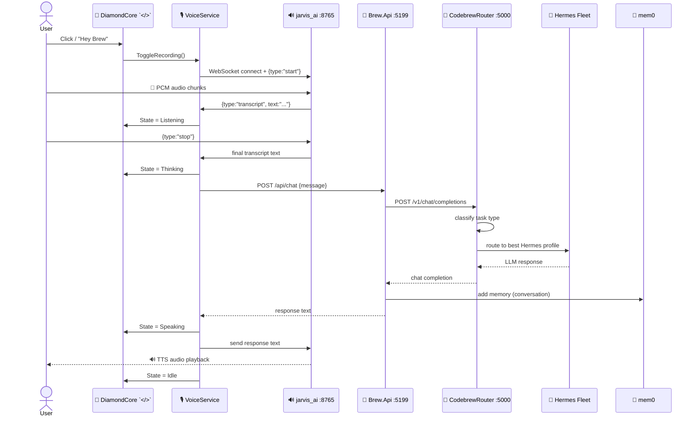
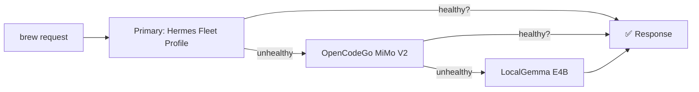

# CodeBrew Architecture

```mermaid
flowchart TB
    subgraph User["🖥️ User"]
        BROWSER["Browser / Phone / Wall Dashboard"]
        VOICE["🎤 Voice: 'Hey Brew'"]
    end

    subgraph BrewApp["🍺 Brew.App — Blazor WASM :5198"]
        DIAMOND["💎 DiamondCore `</>` talking indicator"]
        SPEECH["💬 SpeechBubble typing effect"]
        LAYOUT["📐 BrewLayout sidebar+dashboard"]
        CODEPANEL["📝 CodePanel syntax-highlighted"]
        MEMPANEL["🧠 MemoryPanel mem0 list"]
        VOICESVC["🎙️ VoiceService WebSocket client"]
    end

    subgraph BrewAPI["🍺 Brew.Api — ASP.NET Core :5199"]
        HEALTH["/health"]
        CHAT["/api/chat → RouterService"]
        MEMORY["/api/memory/* → MemoryService"]
    end

    subgraph VoicePipeline["🔊 jarvis_ai — Python FastAPI :8765"]
        STT["STT: faster-whisper (local)"]
        TTS["TTS: ElevenLabs (streaming)"]
        HERMESPROXY["Hermes API Proxy"]
    end

    subgraph Router["🧭 CodebrewRouter — Blaze.LlmGateway :5000"]
        BREW_MODEL["brew virtual model 7 routing rules"]
        TASK_CLASSIFIER["Task Classifier Reasoning|Coding|Research|General"]
        FALLBACK["Fallback Chain"]
    end

    subgraph Fleet["👥 Hermes Fleet — 10 Profiles"]
        LEAD["derp-lead GPT-5.5 coding"]
        THINKER["derp-thinker deepseek-v4-pro architecture"]
        CODER["derp-coder deepseek-v4-flash simple code"]
        SERVER["derp-server deepseek-v4-flash infra"]
        DEFAULT["derp dispatcher general"]
        TRAINER["derp-trainer docs/research"]
    end

    subgraph Local["🏠 Local Inference — LM Kit"]
        LOCALGEMMA["LocalGemma Gemma-4-E4B 7.5B Q4_K_M 4-5GB RAM"]
    end

    subgraph Memory["🧠 Persistent Memory"]
        MEM0["mem0 Platform API user:codebrew agent:brew"]
    end

    VOICE -->|"WebSocket PCM audio"| STT
    STT -->|"transcript text"| VOICESVC
    VOICESVC -->|"state: listening→thinking→speaking"| DIAMOND
    VOICESVC -->|"transcript text"| SPEECH
    DIAMOND -->|"click toggle"| VOICESVC
    VOICESVC -->|"TTS PCM audio"| BROWSER

    CHAT -->|"POST chat"| BREW_MODEL
    BREW_MODEL -->|"classify task"| TASK_CLASSIFIER
    TASK_CLASSIFIER -->|"Coding"| LEAD
    TASK_CLASSIFIER -->|"Reasoning"| THINKER
    TASK_CLASSIFIER -->|"Simple Code"| CODER
    TASK_CLASSIFIER -->|"Infrastructure"| SERVER
    TASK_CLASSIFIER -->|"General"| DEFAULT
    FALLBACK -->|"cloud fallback"| LOCALGEMMA
    
    MEMORY -->|"add/search/get"| MEM0

    LEAD -->|"fallback"| FALLBACK
    THINKER -->|"fallback"| FALLBACK
    CODER -->|"fallback"| FALLBACK
    SERVER -->|"fallback"| FALLBACK
    DEFAULT -->|"fallback"| FALLBACK

    BROWSER --> DIAMOND
    BROWSER --> LAYOUT
    LAYOUT --> CODEPANEL
    LAYOUT --> MEMPANEL
    CHAT --> BREW_MODEL
    MEMORY --> MEM0
    TTS --> BROWSER
```

## Flow: Voice Interaction

```mermaid
sequenceDiagram
    actor User
    participant Diamond as 💎 DiamondCore `</>`
    participant Voice as 🎙️ VoiceService
    participant Jarvis as 🔊 jarvis_ai :8765
    participant API as 🍺 Brew.Api :5199
    participant Router as 🧭 CodebrewRouter :5000
    participant Fleet as 👥 Hermes Fleet
    participant mem0 as 🧠 mem0

    User->>Diamond: Click / "Hey Brew"
    Diamond->>Voice: ToggleRecording()
    Voice->>Jarvis: WebSocket connect + {type:"start"}
    User->>Jarvis: 🎤 PCM audio chunks
    Jarvis->>Voice: {type:"transcript", text:"..."}
    Voice->>Diamond: State = Listening
    User->>Jarvis: {type:"stop"}
    Jarvis->>Voice: final transcript text
    Voice->>Diamond: State = Thinking
    Voice->>API: POST /api/chat {message}
    API->>Router: POST /v1/chat/completions
    Router->>Router: classify task type
    Router->>Fleet: route to best Hermes profile
    Fleet-->>Router: LLM response
    Router-->>API: chat completion
    API->>mem0: add memory (conversation)
    API-->>Voice: response text
    Voice->>Diamond: State = Speaking
    Voice->>Jarvis: send response text
    Jarvis-->>User: 🔊 TTS audio playback
    Voice->>Diamond: State = Idle
```

## Fallback Chain

```mermaid
flowchart LR
    BREW["brew request"] --> PRIMARY["Primary: Hermes Fleet Profile"]
    PRIMARY -->|"healthy?"| OK["✅ Response"]
    PRIMARY -->|"unhealthy"| CLOUD["OpenCodeGo MiMo V2"]
    CLOUD -->|"healthy?"| OK
    CLOUD -->|"unhealthy"| LOCAL["LocalGemma E4B"]
    LOCAL --> OK
```
